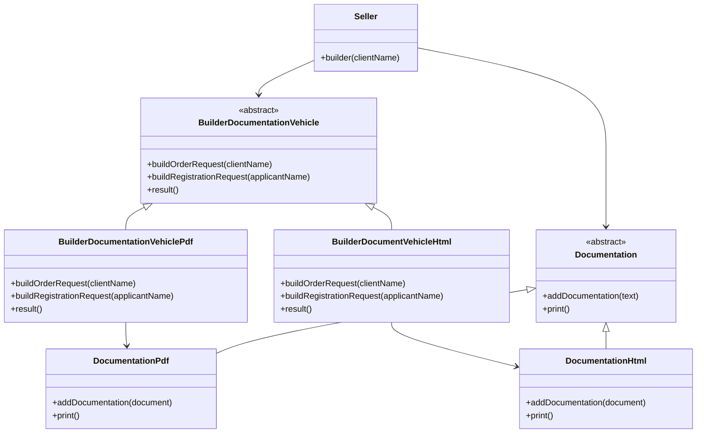

# Abstract Factory Vehículos

## Explicación funcional

Este proyecto permite generar documentación de compra de vehículos en diferentes formatos (PDF y HTML) utilizando el patrón Builder. El usuario selecciona el formato deseado y el sistema crea los documentos correspondientes.

## Explicación técnica

La clase `Seller` utiliza un objeto `BuilderDocumentationVehicle` para construir una instancia de `Documentation`. El método `builder` recibe el nombre del cliente y coordina la construcción de la documentación, llamando a los métodos necesarios en el builder. Finalmente, obtiene el resultado construido y lo retorna.

## Explicación del patrón

Se aplica el patrón Builder para separar la construcción de un objeto complejo (`Documentation`) de su representación. El Director (`Seller`) dirige el proceso de construcción usando un Builder (`BuilderDocumentationVehicle`). Esto permite crear diferentes variantes de documentación sin modificar el proceso de construcción.

- **Director:** Seller  
- **Builder:** BuilderDocumentationVehicle  
- **Producto:** Documentation  

## Diagrama de clases

